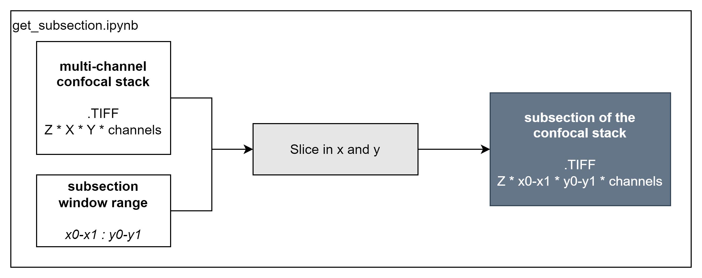

# get_subsection.ipynb
Notebook to get a subsection of a multi-plane multi-channel stack. Useful for trying out/validating notebooks.

*Example output:*
> Region in the window is outputted as a TIFF file, retaining the channel information.
