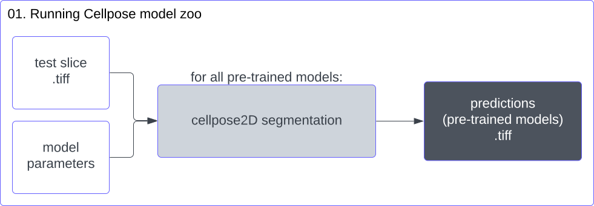
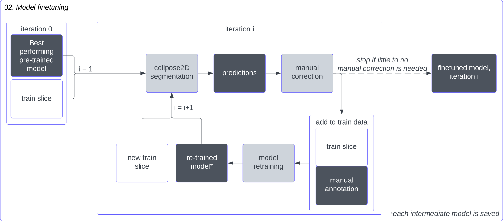

*Legend* 

# 01_run_cellpose_pretrained_models.ipynb
- Notebook to run pre-trained Cellpose models (v2.2.2) [1] on a single microscopy slice.

# 02_HITL_finetuning.ipynb
- Notebook to finetune a pre-trained Cellpose model using a human-in-the-loop approach.

# 03_run_cellpose_single_model.ipynb
- Notebook to run a (finetuned) Cellpose model on one or more microscopy stacks.