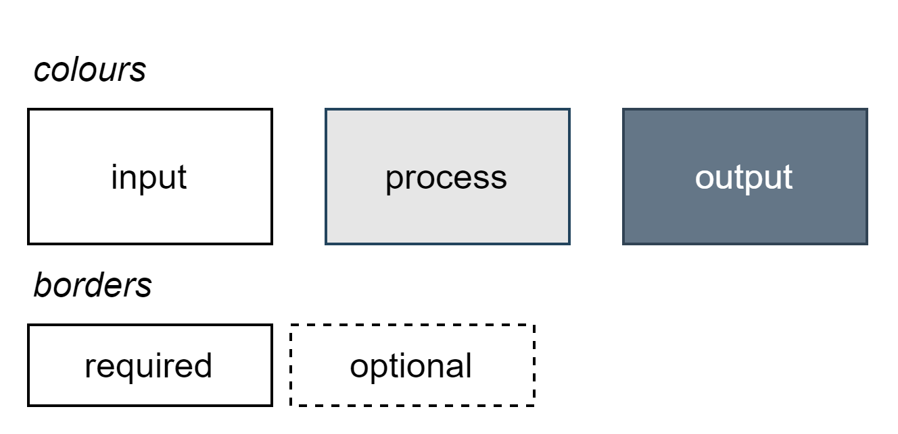
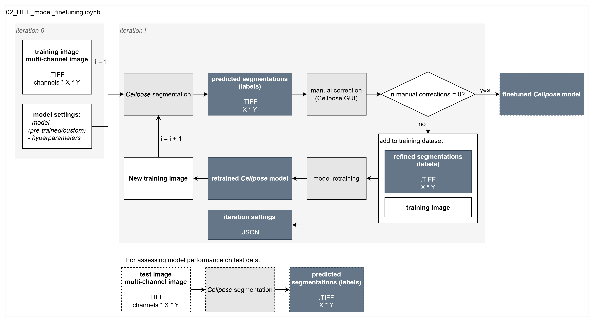
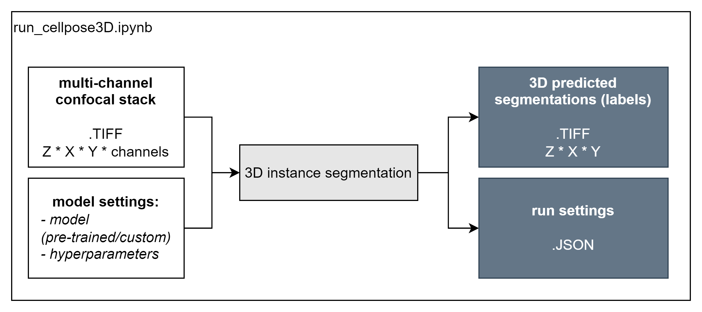

*Legend* 

# 01_run_2Dcellpose_modelzoo.ipynb
Notebook to run pre-trained Cellpose models (v2.2.2) [1] on a 2D microscopy slice.

Useful for determining the best performing model out-of-the-box for further finetuning.

# 02_HITL_finetuning.ipynb
Notebook to finetune a pre-trained Cellpose model using a human-in-the-loop approach.

# 03_run_3Dcellpose.ipynb
Notebook to run a (finetuned) Cellpose model on 3D microscopy data.

# 04_foci_segmentation.ipynb
Notebook for (nuclear) detection using Otsu thresholding.

# References
1. Pachitariu, M., Stringer, C. Cellpose 2.0: how to train your own model. Nat Methods 19, 1634–1641 (2022). https://doi.org/10.1038/s41592-022-01663-4