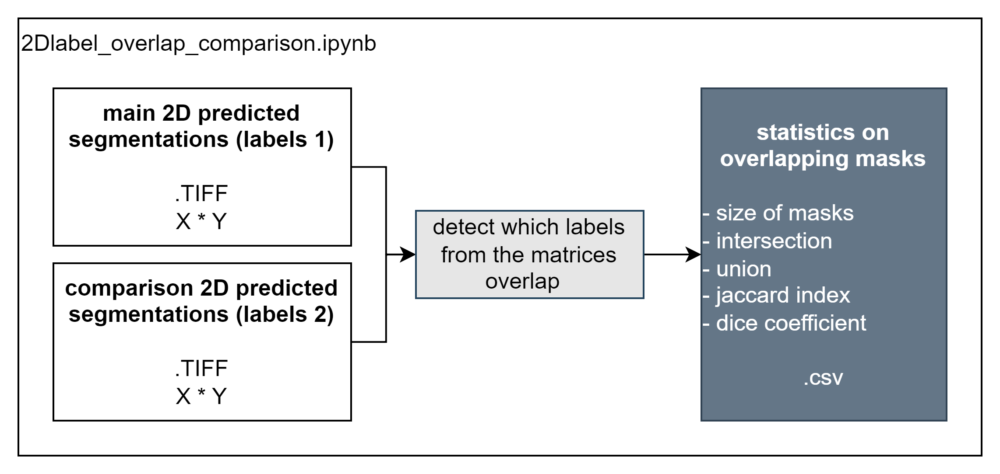

*Currently under construction..*
*Legend* 

# 2Dlabel_overlap_comparison.ipynb
Notebook to retrieve statistics on overlapping masks between two label matrices.

*Used for comparing manual and predicted annotations to assess model performance.*

