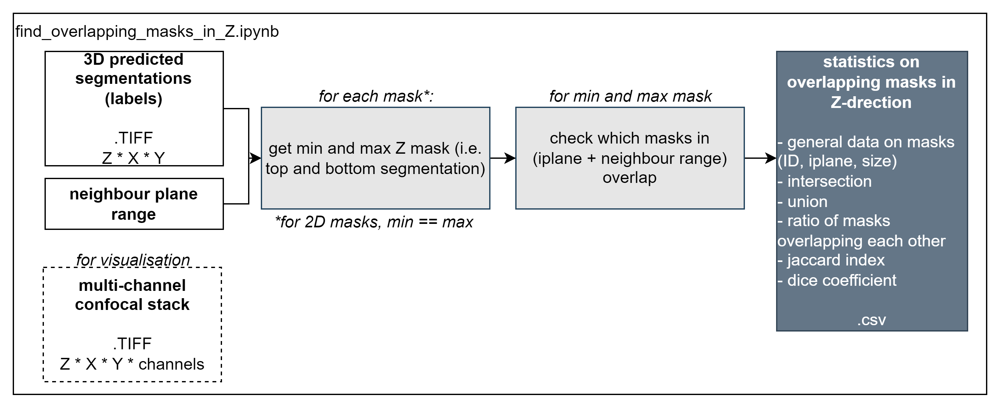

*Legend* 

# [2Dlabel_overlap_comparison.ipynb](./2Dlabel_overlap_comparison.ipynb)
Notebook to retrieve statistics on overlapping masks between two label matrices.

*Used for comparing manual and predicted annotations to assess model performance.*

# [find_overlapping_masks_in_Z.ipynb](./find_overlapping_masks_in_Z.ipynb)
Notebook to detect overlapping masks in Z-direction.

*Works for labels that are 1 plane high or span multiple planes.*

