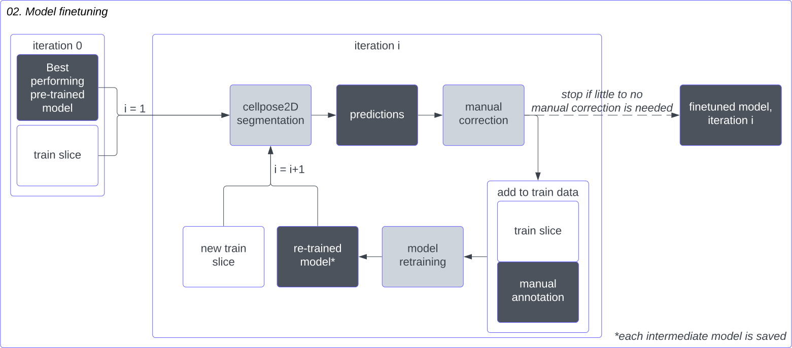

# Overview
*Legend* 

*note: each notebook can be converted into a python script to run from the CLI*

## Categories
### Init
Notebooks for optional pre-processing.
Currently: a notebook to get x-y subsection(s) of stacks.
### Segmentation
Notebooks for segmentation of nuclei and foci in (confocal) microscopy data.

### Quality control
Notebooks for filtering/refining masks.
- Merging masks in Z-direction
- Removing masks based on mask statistics (e.g., size, overlap)

### Quantification
Notebooks for quantitative analyses.
- model_output_comparison.ipynb: Comparison manual and predicted annotations
    - model_comparison_plots.ipynb: Visualising the output.
- Signal intensities: *soon..*

## Description
### 01_run_cellpose_pretrained_models.ipynb
- Notebook to run pre-trained Cellpose models (v2.2.2) [1] on a single microscopy slice.

### 02_HITL_finetuning.ipynb
- Notebook to finetune a pre-trained Cellpose model using a human-in-the-loop approach.

### 03_run_cellpose_single_model.ipynb
- Notebook to run a (finetuned) Cellpose model on one or more microscopy stacks.

### 04_merge_3d_masks.ipynb
- Notebook to detect and merge 3D masks that are fragmented in the z-direction.

### 05_filter_3d_masks.ipynb
- Notebook to perform quality control on the 3D masks for downstream processes.

### model_output_comparison.ipynb
- Notebook to compare manual and predicted segmentations (precision, recall, F1-score, Jaccard Indices)

# References
1. Pachitariu, M., Stringer, C. Cellpose 2.0: how to train your own model. Nat Methods 19, 1634–1641 (2022). https://doi.org/10.1038/s41592-022-01663-4
